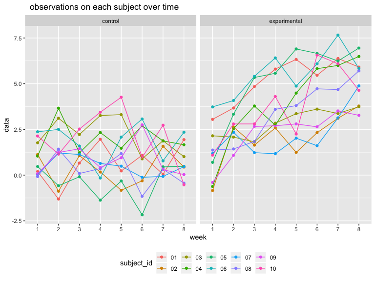
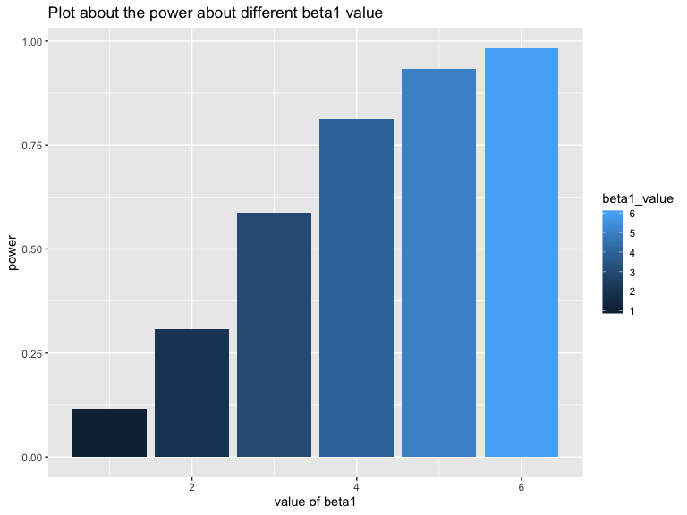
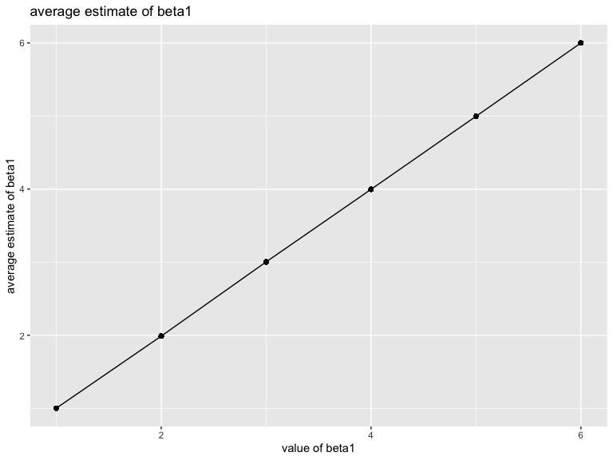
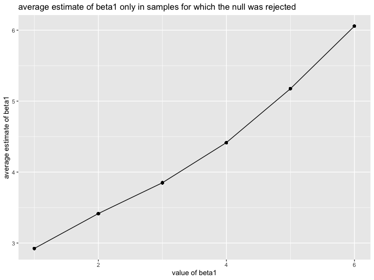
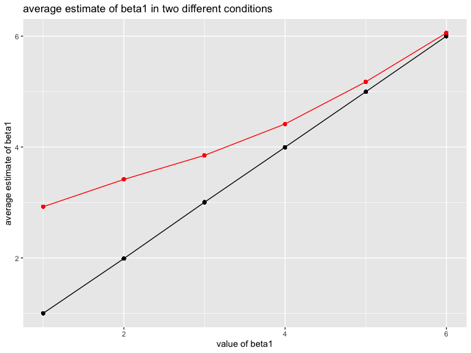

p8105\_hw5\_al3998
================
AimingLiu
10/31/2019

``` r
set.seed(10)
iris_with_missing = iris %>% 
  map_df(~replace(.x, sample(1:150, 20), NA)) %>%
  mutate(Species = as.character(Species)) %>% 
  janitor::clean_names()  
```

## Problem 1

### write the function

``` r
  NAmean = function(x){
    if (is.numeric(x)){
    replace(x, is.na(x), mean(x, na.rm = TRUE))
    }else if(is.character(x)){
     replace(x, is.na(x), "virginica") 
    }
  }
```

``` r
 output = vector("list", length = 5)
  for(i in 1:5){
    output[[i]] = NAmean(iris_with_missing[[i]])
  }
  output = map(iris_with_missing, NAmean)
  output
```

    ## $sepal_length
    ##   [1] 5.100000 4.900000 4.700000 4.600000 5.000000 5.400000 5.819231
    ##   [8] 5.000000 4.400000 4.900000 5.400000 4.800000 5.819231 4.300000
    ##  [15] 5.819231 5.700000 5.400000 5.100000 5.700000 5.100000 5.400000
    ##  [22] 5.100000 4.600000 5.819231 4.800000 5.000000 5.000000 5.200000
    ##  [29] 5.819231 4.700000 4.800000 5.400000 5.200000 5.500000 4.900000
    ##  [36] 5.000000 5.500000 4.900000 4.400000 5.100000 5.000000 4.500000
    ##  [43] 4.400000 5.000000 5.100000 4.800000 5.100000 4.600000 5.300000
    ##  [50] 5.000000 7.000000 6.400000 6.900000 5.500000 6.500000 5.700000
    ##  [57] 6.300000 4.900000 6.600000 5.200000 5.000000 5.900000 6.000000
    ##  [64] 6.100000 5.600000 6.700000 5.600000 5.800000 6.200000 5.600000
    ##  [71] 5.900000 5.819231 6.300000 5.819231 6.400000 6.600000 6.800000
    ##  [78] 6.700000 6.000000 5.700000 5.500000 5.819231 5.800000 6.000000
    ##  [85] 5.400000 5.819231 6.700000 5.819231 5.600000 5.500000 5.500000
    ##  [92] 5.819231 5.800000 5.000000 5.819231 5.700000 5.700000 6.200000
    ##  [99] 5.100000 5.700000 6.300000 5.800000 7.100000 6.300000 6.500000
    ## [106] 7.600000 4.900000 7.300000 6.700000 5.819231 6.500000 5.819231
    ## [113] 6.800000 5.700000 5.800000 6.400000 6.500000 7.700000 7.700000
    ## [120] 6.000000 5.819231 5.600000 7.700000 6.300000 6.700000 7.200000
    ## [127] 6.200000 6.100000 6.400000 7.200000 7.400000 7.900000 6.400000
    ## [134] 5.819231 6.100000 5.819231 5.819231 6.400000 6.000000 6.900000
    ## [141] 6.700000 6.900000 5.819231 6.800000 6.700000 6.700000 6.300000
    ## [148] 6.500000 5.819231 5.900000
    ## 
    ## $sepal_width
    ##   [1] 3.500000 3.000000 3.200000 3.100000 3.600000 3.900000 3.400000
    ##   [8] 3.400000 2.900000 3.100000 3.075385 3.400000 3.075385 3.000000
    ##  [15] 4.000000 4.400000 3.900000 3.500000 3.800000 3.800000 3.400000
    ##  [22] 3.700000 3.600000 3.300000 3.400000 3.000000 3.400000 3.500000
    ##  [29] 3.400000 3.200000 3.100000 3.075385 3.075385 4.200000 3.100000
    ##  [36] 3.200000 3.500000 3.600000 3.000000 3.400000 3.500000 3.075385
    ##  [43] 3.200000 3.500000 3.800000 3.000000 3.800000 3.200000 3.700000
    ##  [50] 3.075385 3.075385 3.200000 3.100000 2.300000 2.800000 2.800000
    ##  [57] 3.300000 2.400000 2.900000 2.700000 2.000000 3.000000 2.200000
    ##  [64] 2.900000 2.900000 3.100000 3.000000 3.075385 2.200000 2.500000
    ##  [71] 3.200000 2.800000 2.500000 2.800000 2.900000 3.000000 2.800000
    ##  [78] 3.075385 3.075385 2.600000 2.400000 2.400000 2.700000 2.700000
    ##  [85] 3.000000 3.400000 3.100000 3.075385 3.000000 2.500000 3.075385
    ##  [92] 3.075385 3.075385 2.300000 2.700000 3.000000 2.900000 2.900000
    ##  [99] 2.500000 2.800000 3.075385 2.700000 3.000000 2.900000 3.075385
    ## [106] 3.000000 2.500000 2.900000 3.075385 3.600000 3.200000 2.700000
    ## [113] 3.000000 3.075385 2.800000 3.200000 3.000000 3.800000 2.600000
    ## [120] 2.200000 3.200000 3.075385 2.800000 2.700000 3.300000 3.200000
    ## [127] 2.800000 3.000000 2.800000 3.000000 2.800000 3.800000 2.800000
    ## [134] 2.800000 3.075385 3.000000 3.400000 3.100000 3.000000 3.100000
    ## [141] 3.100000 3.100000 2.700000 3.200000 3.300000 3.000000 2.500000
    ## [148] 3.000000 3.400000 3.000000
    ## 
    ## $petal_length
    ##   [1] 1.400000 1.400000 1.300000 1.500000 1.400000 1.700000 1.400000
    ##   [8] 1.500000 1.400000 3.765385 1.500000 1.600000 1.400000 3.765385
    ##  [15] 3.765385 1.500000 1.300000 1.400000 1.700000 1.500000 1.700000
    ##  [22] 1.500000 1.000000 3.765385 1.900000 3.765385 1.600000 1.500000
    ##  [29] 1.400000 1.600000 3.765385 1.500000 1.500000 1.400000 3.765385
    ##  [36] 1.200000 1.300000 1.400000 1.300000 1.500000 1.300000 1.300000
    ##  [43] 1.300000 1.600000 1.900000 1.400000 1.600000 3.765385 1.500000
    ##  [50] 1.400000 4.700000 4.500000 4.900000 4.000000 4.600000 4.500000
    ##  [57] 4.700000 3.765385 4.600000 3.900000 3.765385 4.200000 4.000000
    ##  [64] 4.700000 3.600000 4.400000 4.500000 4.100000 4.500000 3.900000
    ##  [71] 4.800000 4.000000 4.900000 3.765385 4.300000 4.400000 4.800000
    ##  [78] 5.000000 4.500000 3.500000 3.800000 3.700000 3.900000 5.100000
    ##  [85] 4.500000 4.500000 4.700000 4.400000 3.765385 4.000000 4.400000
    ##  [92] 4.600000 4.000000 3.300000 4.200000 4.200000 4.200000 4.300000
    ##  [99] 3.000000 4.100000 3.765385 5.100000 5.900000 5.600000 5.800000
    ## [106] 6.600000 4.500000 6.300000 3.765385 3.765385 5.100000 5.300000
    ## [113] 5.500000 5.000000 5.100000 5.300000 3.765385 6.700000 6.900000
    ## [120] 5.000000 5.700000 4.900000 6.700000 4.900000 5.700000 6.000000
    ## [127] 4.800000 4.900000 5.600000 5.800000 6.100000 3.765385 3.765385
    ## [134] 5.100000 5.600000 6.100000 5.600000 5.500000 4.800000 5.400000
    ## [141] 5.600000 5.100000 5.100000 3.765385 3.765385 5.200000 5.000000
    ## [148] 5.200000 5.400000 5.100000
    ## 
    ## $petal_width
    ##   [1] 0.200000 0.200000 0.200000 1.192308 0.200000 0.400000 0.300000
    ##   [8] 0.200000 0.200000 0.100000 0.200000 0.200000 0.100000 0.100000
    ##  [15] 0.200000 0.400000 0.400000 1.192308 0.300000 1.192308 0.200000
    ##  [22] 0.400000 0.200000 0.500000 0.200000 0.200000 0.400000 0.200000
    ##  [29] 0.200000 0.200000 0.200000 0.400000 0.100000 0.200000 0.200000
    ##  [36] 0.200000 0.200000 0.100000 1.192308 0.200000 0.300000 1.192308
    ##  [43] 0.200000 0.600000 0.400000 0.300000 0.200000 0.200000 0.200000
    ##  [50] 0.200000 1.400000 1.500000 1.500000 1.300000 1.500000 1.300000
    ##  [57] 1.600000 1.000000 1.300000 1.400000 1.000000 1.500000 1.192308
    ##  [64] 1.400000 1.300000 1.400000 1.500000 1.000000 1.500000 1.100000
    ##  [71] 1.800000 1.300000 1.500000 1.200000 1.300000 1.400000 1.400000
    ##  [78] 1.192308 1.192308 1.000000 1.100000 1.000000 1.200000 1.600000
    ##  [85] 1.500000 1.600000 1.192308 1.300000 1.192308 1.192308 1.200000
    ##  [92] 1.192308 1.192308 1.192308 1.300000 1.200000 1.300000 1.300000
    ##  [99] 1.192308 1.300000 2.500000 1.900000 2.100000 1.800000 2.200000
    ## [106] 2.100000 1.700000 1.800000 1.800000 2.500000 2.000000 1.900000
    ## [113] 2.100000 2.000000 2.400000 2.300000 1.800000 1.192308 2.300000
    ## [120] 1.500000 1.192308 2.000000 2.000000 1.800000 2.100000 1.800000
    ## [127] 1.800000 1.800000 2.100000 1.600000 1.192308 2.000000 2.200000
    ## [134] 1.500000 1.400000 2.300000 1.192308 1.192308 1.800000 2.100000
    ## [141] 2.400000 2.300000 1.900000 2.300000 2.500000 2.300000 1.900000
    ## [148] 2.000000 2.300000 1.800000
    ## 
    ## $species
    ##   [1] "setosa"     "setosa"     "setosa"     "setosa"     "setosa"    
    ##   [6] "setosa"     "setosa"     "setosa"     "setosa"     "setosa"    
    ##  [11] "setosa"     "setosa"     "setosa"     "setosa"     "setosa"    
    ##  [16] "setosa"     "setosa"     "setosa"     "setosa"     "setosa"    
    ##  [21] "setosa"     "virginica"  "setosa"     "setosa"     "virginica" 
    ##  [26] "setosa"     "virginica"  "setosa"     "setosa"     "setosa"    
    ##  [31] "setosa"     "setosa"     "setosa"     "setosa"     "setosa"    
    ##  [36] "setosa"     "setosa"     "setosa"     "setosa"     "setosa"    
    ##  [41] "setosa"     "virginica"  "setosa"     "setosa"     "setosa"    
    ##  [46] "virginica"  "setosa"     "setosa"     "setosa"     "setosa"    
    ##  [51] "virginica"  "versicolor" "versicolor" "versicolor" "versicolor"
    ##  [56] "versicolor" "virginica"  "versicolor" "virginica"  "versicolor"
    ##  [61] "versicolor" "versicolor" "versicolor" "versicolor" "versicolor"
    ##  [66] "versicolor" "versicolor" "versicolor" "versicolor" "versicolor"
    ##  [71] "versicolor" "virginica"  "versicolor" "versicolor" "versicolor"
    ##  [76] "versicolor" "versicolor" "versicolor" "versicolor" "virginica" 
    ##  [81] "versicolor" "versicolor" "versicolor" "versicolor" "versicolor"
    ##  [86] "versicolor" "versicolor" "versicolor" "versicolor" "versicolor"
    ##  [91] "versicolor" "versicolor" "versicolor" "virginica"  "versicolor"
    ##  [96] "versicolor" "versicolor" "versicolor" "versicolor" "virginica" 
    ## [101] "virginica"  "virginica"  "virginica"  "virginica"  "virginica" 
    ## [106] "virginica"  "virginica"  "virginica"  "virginica"  "virginica" 
    ## [111] "virginica"  "virginica"  "virginica"  "virginica"  "virginica" 
    ## [116] "virginica"  "virginica"  "virginica"  "virginica"  "virginica" 
    ## [121] "virginica"  "virginica"  "virginica"  "virginica"  "virginica" 
    ## [126] "virginica"  "virginica"  "virginica"  "virginica"  "virginica" 
    ## [131] "virginica"  "virginica"  "virginica"  "virginica"  "virginica" 
    ## [136] "virginica"  "virginica"  "virginica"  "virginica"  "virginica" 
    ## [141] "virginica"  "virginica"  "virginica"  "virginica"  "virginica" 
    ## [146] "virginica"  "virginica"  "virginica"  "virginica"  "virginica"

## Problem 2

``` r
file_list = as.data.frame(list.files(path = "./data/", pattern="*.csv")) 
 colnames(file_list) =  "file_name"
```

``` r
file_path =  "./data/"
read_file = function(file_name){
         read_csv(paste0(file_path, file_name))
         
}

output = purrr::map(file_list$file_name, read_file)
```

``` r
file_nest = 
  file_list %>% 
  mutate(data = purrr::map(file_list$file_name, read_file)) %>% 
  unnest()
```

``` r
  file_tidy = file_nest %>% 
  pivot_longer(week_1:week_8,
               names_to = "week",
               values_to = "data") %>% 
  mutate(file_name = str_remove(file_name, ".csv"),
         week = str_remove(week, "week_")) %>% 
  separate(file_name,into = c("group", "subject_id"), sep = "_") %>% 
  mutate(group = recode(group,"con"="control","exp" = "experimental"))
  ggplot(file_tidy,aes(x= week,y = data,color =subject_id,group = subject_id))+
  geom_point()+
  geom_line()+
  labs(
     title = "  observations on each subject over time",
     x = "week",
     y = "data"
  )+ theme(legend.position = "bottom")+
  facet_grid(~group)
```



The fluctuation of data between different weeks are larger in
experiental group than in control group.

And we can notice that the data in week 1 and week 8 in control group
are almost the same.But in experimental group,from week 1 to week 8,the
data become larger which means that intervening measure may be useful.

# Problem 3

## writen the function

``` r
sim_regression = function(n = 30, beta0 = 2, beta1) {
  sim_data = tibble(
    x = rnorm(30, mean = 0, sd = 1),
    y = beta0 + beta1 * x + rnorm(30, 0, sqrt(50))
  )
  ls_fit = lm(y ~ x, data = sim_data)
  ls_tidy = broom::tidy(ls_fit)
  tibble(
   beta1_hat = ls_tidy$estimate[2],
   p_value = ls_tidy$p.value[2])
}
```

Generate 10000 datasets from the model

``` r
set.seed(10)
output_b1 = rerun(10000, sim_regression(beta1 = 0)) %>% 
 bind_rows()

head(output_b1)
```

    ## # A tibble: 6 x 2
    ##   beta1_hat p_value
    ##       <dbl>   <dbl>
    ## 1    -2.44   0.0895
    ## 2    -0.366  0.769 
    ## 3     2.10   0.0917
    ## 4    -0.963  0.431 
    ## 5     1.61   0.192 
    ## 6     0.213  0.880

Repeat the above for β1={1,2,3,4,5,6}

``` r
beta_list = list("beta1_1"  = 1, 
                 "beta1_2"  = 2, 
                 "beta1_3"  = 3, 
                 "beta1_4"  = 4,
                 "beta1_5"  = 5,
                 "beta1_6"  = 6)
output = vector("list", length = 6)

for (i in 1:6) {
  output[[i]] = rerun(10000, sim_regression(beta1 = beta_list[[i]])) %>% 
    bind_rows
}
```

``` r
beta_results = 
  tibble(beta1_value = c(1,2,3,4,5,6)) %>% 
  mutate(
    output_lists = map(.x = beta1_value, ~rerun(10000, sim_regression(beta1 = .x))),
    estimate_dfs = map(output_lists, bind_rows)) %>% 
  select(-output_lists) %>% 
  unnest(estimate_dfs)

  head(beta_results)
```

    ## # A tibble: 6 x 3
    ##   beta1_value beta1_hat p_value
    ##         <dbl>     <dbl>   <dbl>
    ## 1           1     0.828  0.583 
    ## 2           1     1.71   0.156 
    ## 3           1    -0.957  0.598 
    ## 4           1     2.13   0.0461
    ## 5           1     1.14   0.632 
    ## 6           1     1.43   0.304

``` r
  beta_sig = beta_results %>% 
  group_by(beta1_value) %>% 
  filter(p_value < 0.05) %>% 
  group_by(beta1_value) %>% 
  mutate(power = n()/10000) 
  plot = ggplot(beta_sig,aes(x = beta1_value,y = power))+
    geom_col()+
    labs(
    title = "Plot about the power about different beta1 value",
    x = "value of beta1",
    y = "power")  
   plot     
```



### Make a plot showing the average estimate of beta1 and the true value of beta1

``` r
  beta_mean = beta_results %>% 
  group_by(beta1_value) %>% 
  mutate(mean = mean(beta1_hat)) 
  plot1 = ggplot(beta_mean,aes(x = beta1_value,y = mean))+
    geom_line()+
    geom_point()+
    labs(
    title = "average estimate of beta1",
    x = "value of beta1",
    y = "average estimate of beta1")  
   plot1    
```



### Make a second plot on the average estimate of beta1 only in samples for which the null was rejected and the true value of beta1

``` r
 beta_sig_ave = beta_sig %>% 
 mutate(mean_sig = mean(beta1_hat)) 
 plot2 = ggplot(beta_sig_ave,aes(x = beta1_value,y = mean_sig))+
    geom_line()+
    geom_point()+
    labs(
    title = "average estimate of beta1 only in samples for which the null was rejected",
    x = "value of beta1",
    y = "average estimate of beta1") 
  plot2
```



``` r
beta_sig_ave = beta_sig %>% 
 mutate(mean_sig = mean(beta1_hat)) 
 plot3 =plot1+
   geom_line(data = beta_sig_ave,aes(x = beta1_value,y = mean_sig),color = "red")+
   geom_point(data =beta_sig_ave,aes(x = beta1_value,y = mean_sig),color = "red")+
    labs(
    title = "average estimate of beta1 in two different conditions",
    x = "value of beta1",
    y = "average estimate of beta1") 
  plot3
```



The sample average of β̂1 across tests for which the null is rejected
approximately is not equal to the true value of β1. Because when we
reject the null hypothesis,we consider that β̂1 we got is significant
different from β1,and then we calculate the mean,it can not be equal to
the value of beta1.
